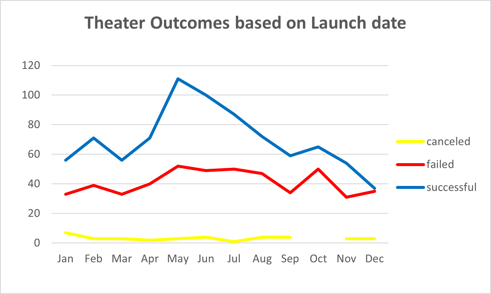
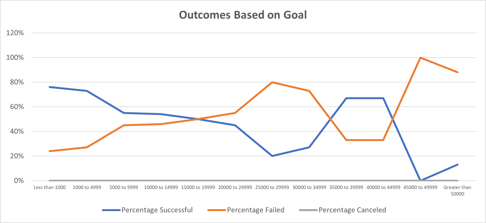

# Kickstarting with Excel

    by Jessica María Ollinger Gaytán

## Overview of Project

Let us go into deep dive for kickstarter projects for the Theater category.

### Purpose

The purpose of this analysis is to find a correlation between launch dates and outcomes as well as the goal amounts.

## Analysis and Challenges

### Analysis of Outcomes Based on Launch Date

By looking into our pivot and graph, it seems the best month to launch a theather category project is May, with the most number of successful outcomes. Mind, the data is an aggregation from 2009 to 2017, it would not be amiss to check the outcomes by month per certain year and even go further into countries and theather subcategories.

### Analysis of Outcomes Based on Goals

The percentage of success for subcategory Plays seems to be correlated to goal amounts less than $5,000 in the currency of the country, with a success rate at the 70s%. The majority of the projects for Plays have a goal of less than 15k, or aprox. 85% of the total population being studied. We could go even further into the analysis to review date from launch and date of deadline to review if the more time a kiskstarter is open affects outcomes as well as the goal amounts.

### Challenges and Difficulties Encountered

The biggest challenge encountered was to create a new column to properly allocate information by a goal amount range. I completed this through a nested ifs, but it might be that we could have created this through a vlookup.

## Results

- What are two conclusions you can draw about the Outcomes based on Launch Date?

    **1** May is the best month to launch theather campaigns in kickstarter, based on historical data from 2009 to 2017.

    **2** December is the worst month to launch theather campaigns in kickstarter, based on historical data from 2009 to 2017.

---

- What can you conclude about the Outcomes based on Goals?

    The percentage of success for the subcategory Plays seems to be correlated to goal amounts less than $5,000 in the currency of the country.

---

- What are some limitations of this dataset?

    The goal and pledged amounts are in the currency of the pertaining country of the kickstarter. If we want to compare amounts, both goals and pledged, and also include analysis by countries, we would need to translate the currency into just one for analytics purposes, example USD.

---

- What are some other possible tables and/or graphs that we could create?

    * Outcomes based on the time allocated between launch and deadline dates. I may be that more months allows a successful outcome.
    * Statistical analysis of pledged amounts vs kickstarter goals pertaining to outcomes. A boxplot table could show us if there were pledges with very deep pocket bankrolling a project into a successful campaing, vs smaller pledge amounts.
    * Do analysis by country, for outcomes and amounts. Previous translation into a common currency, say USD.

---
